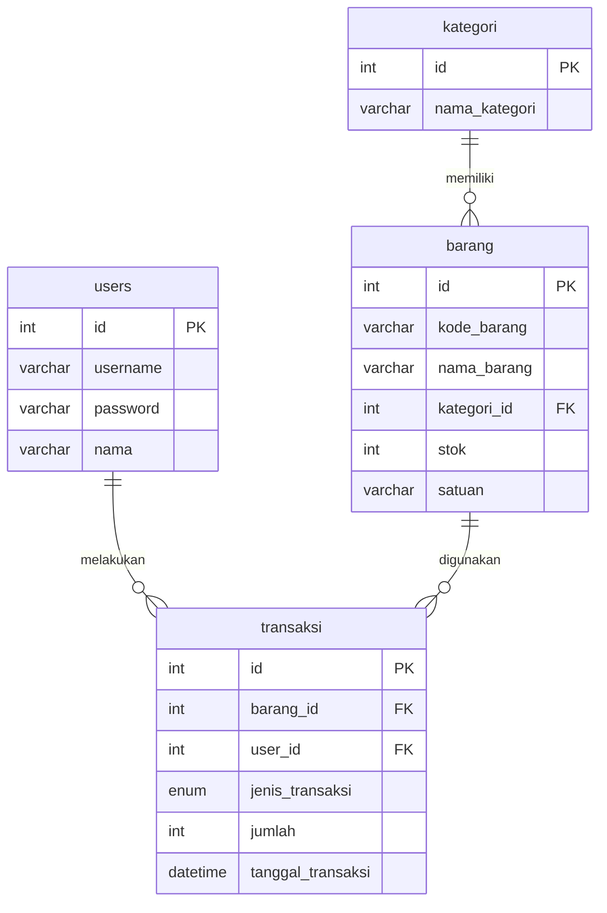
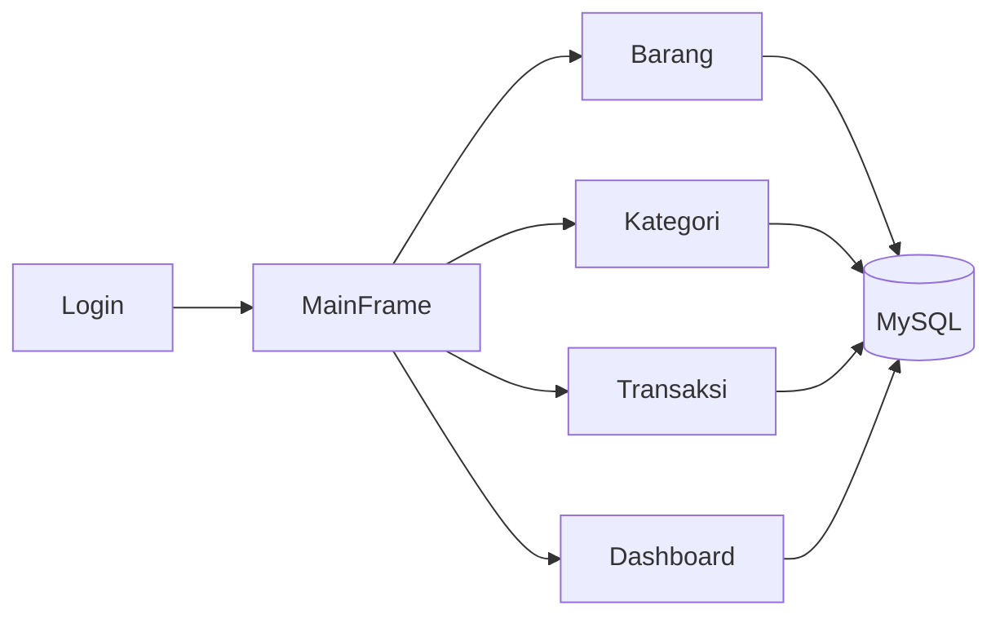

# Inventaris Gudang


Aplikasi desktop untuk mengelola inventaris gudang menggunakan Java Swing, FlatLaf, MigLayout, JDBC, dan MySQL.

```text
┌───────────────────────────────────────────────────────────────┐
│                    INVENTARIS GUDANG                          │
├───────────────┬───────────────────────────────────────────────┤
│ Dashboard     │ Total Barang | Total Kategori | Masuk | Keluar │
│ Barang        │ CRUD barang + pencarian                       │
│ Kategori      │ CRUD kategori + pencarian                     │
│ Transaksi     │ CRUD transaksi + update stok otomatis         │
└───────────────┴───────────────────────────────────────────────┘
```

## Demo Mini

```text
Frame 1:  [Gudang]  📦───────>  stok aman
Frame 2:  [Gudang]  📦── pew ─>  barang masuk
Frame 3:  [Gudang]  📦── pew ─>  barang keluar
Frame 4:  [Gudang]  📦───────>  dashboard update
```

```text
      ┌───────┐
      │ ADMIN │
      └───┬───┘
          │ scan stok
          v
    ╔═══════════╗        pew pew        ╔══════════╗
    ║  BARANG   ║  ──────────────────>  ║ TRANSAKSI║
    ╚═══════════╝                       ╚════╤═════╝
                                             │
                                             v
                                      ╔════════════╗
                                      ║ DASHBOARD  ║
                                      ╚════════════╝
```

## Fitur

- Login dengan password BCrypt.
- Register user ke database.
- Dashboard statistik dari database.
- CRUD Barang.
- CRUD Kategori.
- CRUD Transaksi.
- Update stok otomatis saat transaksi masuk/keluar.
- Pencarian data pada tabel.
- Sidebar navigation dengan `CardLayout`.
- UI modern memakai FlatLaf, MigLayout, dan Ikonli.

## Tech Stack

| Bagian | Teknologi |
| --- | --- |
| Language | Java 21 |
| Build Tool | Maven |
| UI | Swing |
| Look and Feel | FlatLaf |
| Layout | MigLayout |
| Database | MySQL |
| Database Access | JDBC |
| Password Hashing | BCrypt |
| Icons | Ikonli FontAwesome |

## Struktur Project

```text
src/main/java
├── App.java
├── config
│   ├── DatabaseConfig.java
│   ├── DatabaseConnection.java
│   └── DatabaseInitializer.java
├── dao
│   ├── BarangDAO.java
│   ├── KategoriDAO.java
│   ├── TransaksiDAO.java
│   └── UserDAO.java
├── model
│   ├── Barang.java
│   ├── Kategori.java
│   ├── Transaksi.java
│   └── User.java
└── view
    ├── MainFrame.java
    ├── barang
    ├── dashboard
    ├── kategori
    ├── login
    ├── register
    └── transaksi
```

## ERD



## Alur Aplikasi



## Persiapan

Pastikan sudah terinstall:

- JDK 21
- Maven
- XAMPP atau MySQL Server
- IDE seperti VS Code, IntelliJ IDEA, atau NetBeans

## Setup Database

Project ini sudah punya initializer otomatis lewat `DatabaseInitializer`, jadi database dan tabel akan dibuat saat aplikasi dijalankan.

Konfigurasi default:

```text
host     : localhost
port     : 3306
database : inventaris_gudang
username : root
password : 
```

Kalau ingin import manual, gunakan file:

```text
src/main/resources/database/inventaris_gudang.sql
```

## Akun Default

```text
username : admin
password : admin123
```

## Cara Menjalankan

Clone repo:

```bash
git clone <url-repository>
cd inventarisGudang
```

Compile project:

```bash
mvn compile
```

Jalankan dari IDE melalui class:

```text
App.java
```

## Catatan Tim

Jangan commit file hasil build:

```text
target/
*.class
.vscode/
```

Yang penting dicommit:

```text
pom.xml
src/main/java/
src/main/resources/
README.md
```

## Commit Style

Contoh commit message:

```bash
git commit -m "feat(barang): add barang management"
git commit -m "fix(database): repair MySQL integration"
git commit -m "docs: add project README"
```

## License

Project ini dibuat untuk kebutuhan pembelajaran dan tugas kelompok.
